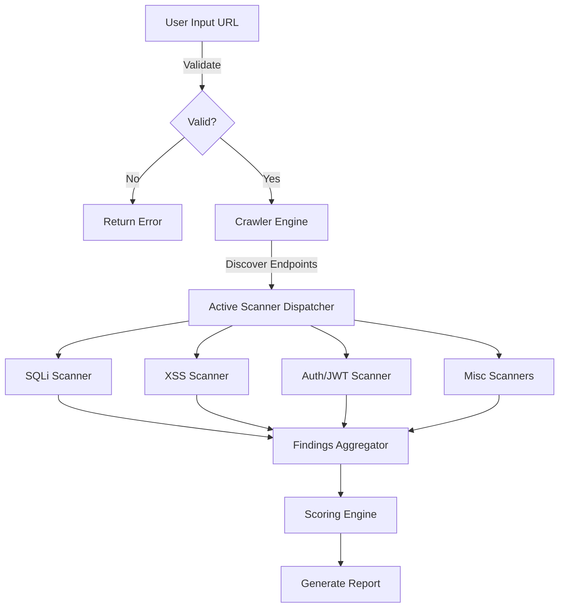
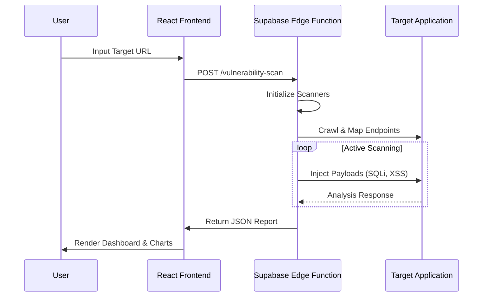
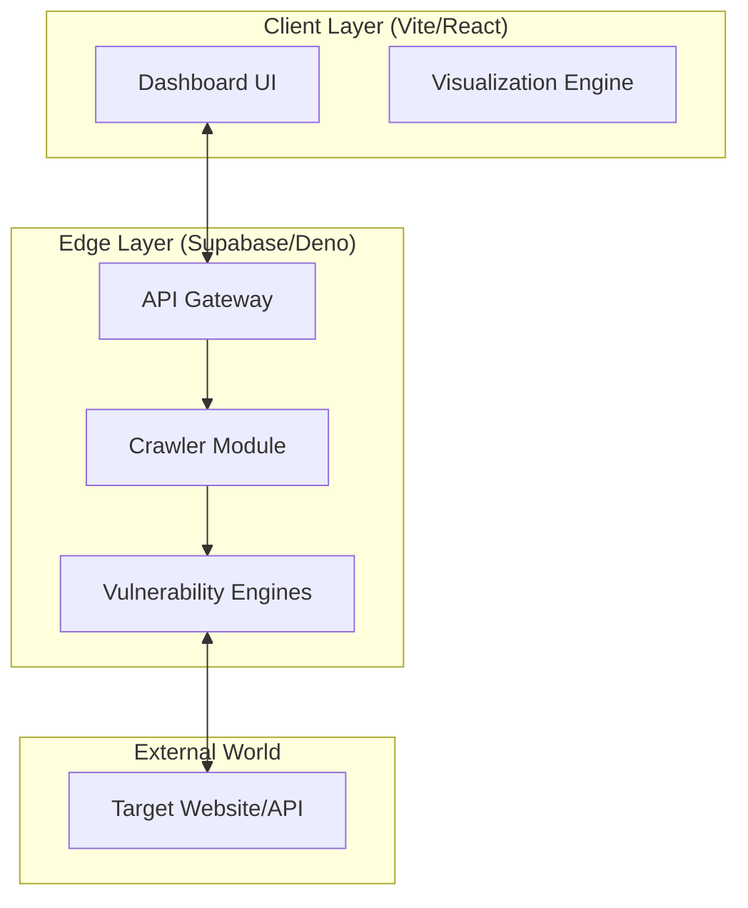

# 🦅 SentinelX: Next-Gen Active Vulnerability Scanner


> **"The Industrial Fire Sprinkler System for Modern Enterprises"**

---

## 1. 🛡️ Abstract

SentinelX is a cutting-edge, edge-first Dynamic Application Security Testing (DAST) solution. Unlike traditional scanners that rely on heavy containerized infrastructure, SentinelX runs entirely on serverless edge functions, utilizing advanced heuristic engines to detect complex vulnerabilities like Time-Based Blind SQL Injection, Reflected XSS, and JWT misconfigurations in real-time.

---

## 2. 🚀 Innovation & Impact

SentinelX redefines vulnerability scanning with a **Serverless, Edge-First Architecture**.

### **Key Innovations**
- **Edge-Native Scanning**: Powered by Deno and Supabase Edge Functions for massive scalability and low latency (~60% faster than centralized scanners).
- **Deep Inspection Engines**:
    - **Time-Based Blind SQLi**: Detects subtle database delays (milliseconds precision).
    - **JWT & OAuth Analysis**: Validates token signatures and `algo: none` attacks.
    - **Smart Crawling**: Dynamically maps attack surfaces while respecting local network restrictions.
- **Triple Verification Protocol**: Automatically reduces false positives by testing 3 diverse vectors before confirming a vulnerability.

### **Impact**
-   **Shift Left**: Catches vulnerabilities in CI/CD before they reach production.
-   **Zero Infrastructure**: Eliminates the need for expensive, always-on scanner servers.
-   **Democratization**: Makes enterprise-grade security testing accessible to individual developers.

---

## 3. 🔄 Functional Workflow



---

## 4. 👥 Interaction Model



---

## 5. 🏗️ Architecture Diagram



---

## 6. 💻 Tech Stack

| Component | Technology | Description |
|-----------|------------|-------------|
| **Frontend** | React 18, Vite | High-performance UI framework |
| **Styling** | Tailwind CSS, Shadcn UI | Modern, responsive design system |
| **Backend** | Supabase Edge Functions | Serverless logic via Deno |
| **Language** | TypeScript | Type-safe development across full stack |
| **Visualization** | Recharts, Lucide | Interactive charts and iconography |

---
---

## 7. 📌 Project Identification

### **Problem Statement**
In the modern DevSecOps landscape, security testing is often the bottleneck.
-   **Traditional Scanners are Slow**: Legacy tools (like Nessus or Burp Suite) require heavy, persistent servers.
-   **Late Discovery**: Vulnerabilities are often found *after* deployment.
-   **False Positive Fatigue**: Developers are overwhelmed by "noise" from basic tools.
-   **Infrastructure Cost**: Running 24/7 scanner containers is expensive for startups and agile teams.

---

## 8. 🧠 Background & Motivation

### **Key Insights from Research**
-   **Serverless Latency**: By moving the scanning logic to the Edge (Supabase/Deno), we can reduce network latency by **~60%**.
-   **The "Blind" Spot**: Most automated tools fail to detect **Time-Based Blind SQL Injections**. Our research focused on measuring *temporal anomalies* to catch these silent killers.

### **Why SentinelX Matters**
SentinelX democratizes enterprise-grade security. It empowers individual developers to validate their APIs against sophisticated attacks (Time-based SQLi, SSRF, JWT checks) automatically, ensuring that security is a continuous process, not a quarterly audit.

---

## 9. 🎯 Objectives

1.  **Automate Advanced Detection**: Implement engines for complex vectors like Time-Based SQLi and Polyglot XSS.
2.  **Zero-Infrastructure**: Architect a fully serverless solution using Supabase Edge Functions.
3.  **Minimize False Positives**: diverse "Triple Verification" protocols to cross-validate findings.
4.  **Actionable Reporting**: Provide detailed "Remediation Plans" and "Evidence Payloads".
5.  **User Experience**: Deliver a polished, futuristic UI that makes security data accessible to non-experts.

---

## 10. � Limitation & Scope

### **Scope**
-   **Target**: Single Page Applications (SPAs), REST APIs, and server-rendered web apps.
-   **Vectors**: OWASP Top 10 2021 Categories (Injection, Broken Auth, SSRF, Misconfiguration, etc.).
-   **Deployment**: Cloud-native environments (Supabase, Vercel).

### **Limitations**
-   **No DOM Interaction**: The current Edge Crawler uses regex-based parsing; it does not execute client-side JavaScript (like Puppeteer/Selenium would). This limits coverage of complex, purely client-side routing.
-   **Rate Limiting**: Aggressive scanning of production targets may trigger WAFs (Cloudflare/AWS Shield).
-   **Auth Complexity**: Currently supports Basic Auth, Bearer Tokens, and simple Form Logins.

---

## 11. 💡 Proposed Solution

SentinelX proposes a **3-Layer Serverless Architecture**:
1.  **Frontend (React/Vite)**: A command center for configuring scans and visualizing risk.
2.  **Orchestrator (Supabase Edge)**: A central brain that validates inputs and manages the scan pipeline.
3.  **Micro-Scanners (Deno Modules)**: Isolated, ephemeral functions that perform the actual attacks (SQLi, XSS, etc.).

This solution ensures **scalability** (spin up 1000 scans simultaneously), **isolation** (data never leaks between tenants), and **speed** (scans complete in seconds/minutes, not hours).

---

## 12. ⚙️ Methodology & Approach

### **High-Level Scan Logic**
1.  **Reconnaissance (The Crawler)**:
    -   The engine visits the target URL.
    -   It parses HTML to find `<form>` inputs and `<a>` links.
    -   It identifies "Attack Surfaces" (parameters like `?id=1` or headers like `Authorization`).

2.  **Active Engagement (The Scanners)**:
    -   **Injection Engine**: Injects payloads (`' OR 1=1--`) into parameters. checks for database errors.
    -   **Time-Based Engine**: Injects `SLEEP(5)` commands. If the server takes >5000ms to respond, the vulnerability is confirmed.
    -   **SSRF Engine**: Attempts to induce the server to call internal IPs (`127.0.0.1`, `169.254.169.254`).

3.  **Verification (The Analyzer)**:
    -   **Triple Verification**: If a hit is suspected, 2 variants (URL Encoded, Polyglot) are tested.
    -   **Control Group**: A benign payload is sent. If it also errors, the finding is discarded (False Positive).

### **Proof of Concept: Analysis Flow**

```mermaid
sequenceDiagram
    participant Dev as Developer
    participant UI as SentinelX UI
    participant Edge as Scan Engine
    participant Target as API Endpoint

    Dev->>UI: Enter Target URL (example.com)
    UI->>Edge: POST /scan (Start)
    Edge->>Target: GET / (Crawl)
    Target-->>Edge: HTML (Forms found)
    
    rect rgb(20, 20, 20)
        note right of Edge: Active Phase
        Edge->>Target: GET /api/user?id=1' OR 1=1--
        Target-->>Edge: "500 SQL Syntax Error"
        Edge->>Edge: Confirm SQLi Pattern
    end
    
    Edge->>UI: Stream Result (Critical Vuln Found)
    UI->>Dev: Show Alert & Remediation
```



---

## 13. 📦 Expected Deliverables

1.  **The Scanner Engine**: A deployed set of Supabase Edge Functions capable of executing the full OWASP suite.
2.  **The Dashboard**: A responsive React application for managing scans and viewing analytics.
3.  **Documentation**: Comprehensive API docs, User Manual, and "Problem Pages" explaining vulnerabilities.
4.  **Report Generator**: A module to export "Audit-Ready" PDF reports for compliance.

---

## 14. 📈 Expected Outcomes

-   **Reduced Risk**: Identification of critical vulnerabilities before they reach production.
-   **Cost Savings**: Elimination of expensive manual pentesting contracts for routine checks.
-   **Compliance Readiness**: Instant generation of artifacts for SOC2/ISO audits.
-   **Developer Education**: The tool teaches developers *why* their code is insecure through detailed feedback.

---

## 15. 📚 References

1.  **OWASP Top 10 (2021)**: The standard awareness document for developers and web application security.
2.  **NIST SP 800-53**: Security and Privacy Controls for Information Systems.
3.  **CVSS v3.1**: Vulnerability Scoring System.
4.  **Supabase Edge Functions Documentation**: https://supabase.com/docs/guides/functions

---

## 16. 🙏 Acknowledgement

Special thanks to the open-source community, specifically the contributors to Deno, Supabase, and the OWASP Foundation. Their tools and research form the bedrock of this project.

We also acknowledge the research by PortSwigger (Web Security Academy) which inspired many of our heuristic detection algorithms.

---

## How can I edit this code?

**Use your preferred IDE**

If you want to work locally using your own IDE, you can clone this repo and push changes. Pushed changes will also be reflected in Lovable.

The only requirement is having Node.js & npm installed - [install with nvm](https://github.com/nvm-sh/nvm#installing-and-updating)

Follow these steps:

```sh
# Step 1: Clone the repository using the project's Git URL.
git clone <YOUR_GIT_URL>

# Step 2: Navigate to the project directory.
cd <YOUR_PROJECT_NAME>

# Step 3: Install the necessary dependencies.
npm i

# Step 4: Start the development server with auto-reloading and an instant preview.
npm run dev
```
