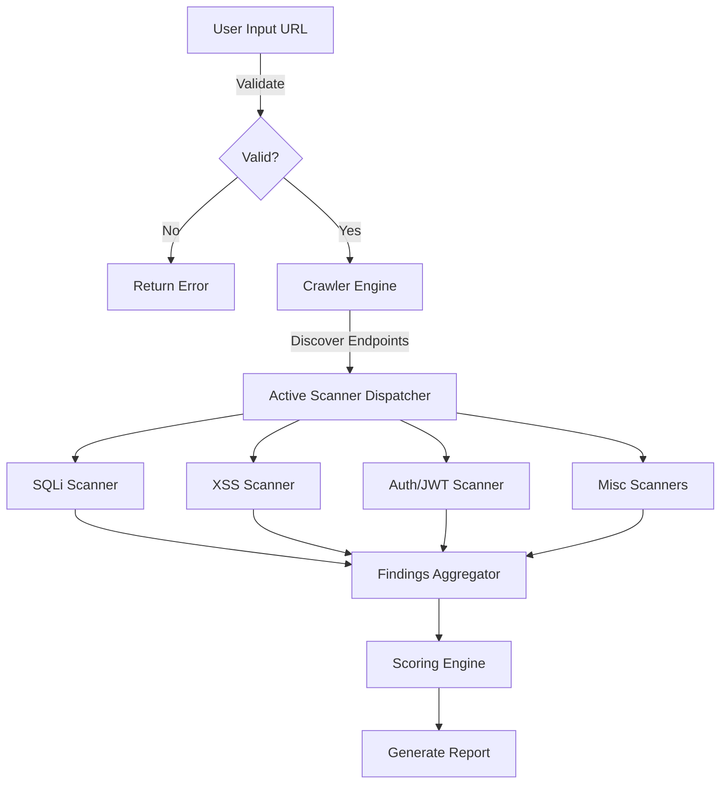
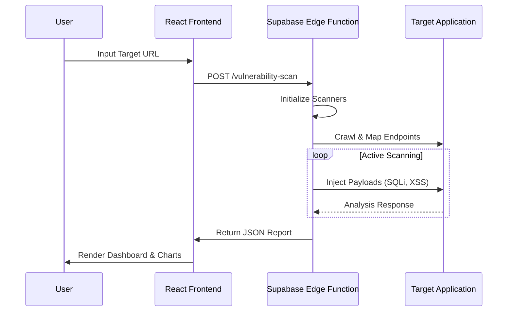
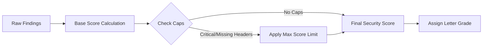
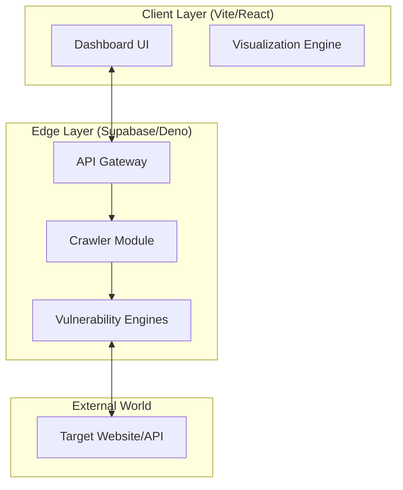

# SentinelX: Next-Gen Active Vulnerability Scanner

## 🛡️ Abstract

SentinelX is a cutting-edge, edge-first Dynamic Application Security Testing (DAST) solution. Unlike traditional scanners that rely on heavy containerized infrastructure, SentinelX runs entirely on serverless edge functions, utilizing advanced heuristic engines to detect complex vulnerabilities like Time-Based SQL Injection, Reflected XSS, and JWT misconfigurations in real-time.

## 🚀 Innovation & Scope

SentinelX redefines vulnerability scanning with a **Serverless, Edge-First Architecture**.

### Key Innovations
- **Edge-Native Scanning**: Powered by Deno and Supabase Edge Functions for massive scalability and low latency.
- **Deep Inspection Engines**:
    - **Time-Based Blind SQLi**: Detects subtle database delays (milliseconds precision).
    - **JWT & OAuth Analysis**: Validates token signatures and `algo: none` attacks.
    - **Smart Crawling**: Dynamically maps attack surfaces while respecting local network restrictions.
- **Micro-Service Scalability**: Each scan runs in an isolated, ephemeral environment.

### Scope
- **Target**: Single Page Applications (SPAs), REST APIs, and traditional Web Apps.
- **Coverage**: OWASP Top 10 (Injection, Broken Access Control, Cryptographic Failures, Security Misconfiguration, SSRF, etc.).
- **Infrastructure**: Zero-config deployment on Supabase.

### 🌟 New Premium Features
- **Interactive Visuals**: Zoomable, pannable, and expandable architecture flowcharts for deep technical understanding.
- **Educational Modules**: 8+ Detailed "Problem Pages" explaining industry challenges with real-world breach scenarios (e.g., Target, Equifax).
- **Research-Grade Docs**: Dedicated feature pages with "Abstract", "Methodology", and "Implementation" sections.

### 🎯 Market Positioning & Target Audience

SentinelX is a **B2B (Business-to-Business)** solution designed for modern engineering teams.

| Feature | B2B (SentinelX) | B2C (Consumer Tools) |
| :--- | :--- | :--- |
| **The Analogy** | **Industrial Fire Sprinkler System** 🏢 | **Home Smoke Detector** 🏠 |
| **Who Buys It?** | The VP of Engineering (Company Budget) | You (Personal Wallet) |
| **Why Buy It?** | To avoid lawsuits, fines, and brand damage. | To avoid viruses on your personal laptop. |
| **Price Tag** | High Value ($$$$ / month) | Low Cost (Free or $50 / year) |
| **Workflow** | runs automatically in the cloud (CI/CD). | You manually click "Scan Now". |
| **If it Fails...** | The company could lose millions in data. | You might lose some personal photos. |
| **Output** | "Ticket #402 Assigned to Dev Team" | "Your PC is Safe!" Green Checkmark |

While built for enterprise needs (SOC2, ISO 27001), SentinelX uses a **Developer-First (PLG)** motion, allowing individual engineers to start validating their APIs immediately without lengthy sales cycles.

### 🏭 Enterprise Use Cases
SentinelX is engineered to solve specific "Business" problems that individual users do not face:

1.  **Automated Compliance Governance (SOC2 Types I & II)**
    *   *The Problem*: Companies must prove to auditors that they scan for vulnerabilities quarterly.
    *   *SentinelX Solution*: Generates cryptographic, time-stamped PDF reports that auditors accept as "Evidence of Controls", automating hundreds of hours of manual evidence collection.

2.  **DevSecOps Pipeline Integration**
    *   *The Problem*: Security is usually a "blocker" at the end of a release cycle.
    *   *SentinelX Solution*: Runs automatically in GitHub Actions/GitLab CI. If a Critical vulnerability (e.g., SQLi) is found, the build fails *before* deployment, preventing expensive hotfixes.

3.  **Third-Party Risk Management (TPRM)**
    *   *The Problem*: Enterprises are liable for the security of the SaaS vendors they use.
    *   *SentinelX Solution*: Large organizations use SentinelX to scan *their vendors'* public endpoints to verify their security claims before signing contracts.

4.  **Cost Reduction (ROI)**
    *   *The Problem*: Manual Penetration Testing costs $15k-$50k per app per year.
    *   *SentinelX Solution*: Provides continuous, automated active scanning for a fraction of the cost, delivering "Pentest-Quality" results daily instead of annually.

## 🔄 Functional Workflow



## 👥 Interaction Model



## 📊 Data Processing Workflow



## 🏗️ Architecture



## 💻 Tech Stack

| Component | Technology | Description |
|-----------|------------|-------------|
| **Frontend** | React 18, Vite | High-performance UI framework |
| **Styling** | Tailwind CSS, Shadcn UI | Modern, responsive design system |
| **Backend** | Supabase Edge Functions | Serverless logic via Deno |
| **Language** | TypeScript | Type-safe development across full stack |
| **Visualization** | Recharts, Lucide | Interactive charts and iconography |

---

## How can I edit this code?

**Use your preferred IDE**

If you want to work locally using your own IDE, you can clone this repo and push changes. Pushed changes will also be reflected in Lovable.

The only requirement is having Node.js & npm installed - [install with nvm](https://github.com/nvm-sh/nvm#installing-and-updating)

Follow these steps:

```sh
# Step 1: Clone the repository using the project's Git URL.
git clone <YOUR_GIT_URL>

# Step 2: Navigate to the project directory.
cd <YOUR_PROJECT_NAME>

# Step 3: Install the necessary dependencies.
npm i

# Step 4: Start the development server with auto-reloading and an instant preview.
npm run dev
```
