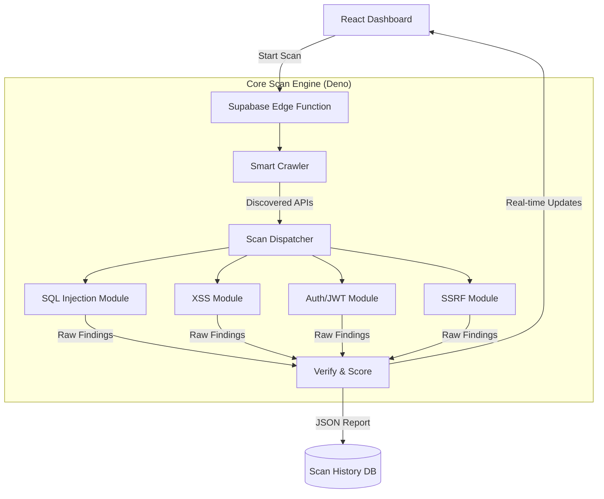

```mermaid
sequenceDiagram
    participant Dev as Developer
    participant UI as SentinelX UI
    participant Edge as Scan Engine
    participant Target as API Endpoint

    Dev->>UI: Enter Target URL (example.com)
    UI->>Edge: POST /scan (Start)
    Edge->>Target: GET / (Crawl)
    Target-->>Edge: HTML (Forms found)
    
    rect rgb(20, 20, 20)
        note right of Edge: Active Phase
        Edge->>Target: GET /api/user?id=1' OR 1=1--
        Target-->>Edge: "500 SQL Syntax Error"
        Edge->>Edge: Confirm SQLi Pattern
    end
    
    Edge->>UI: Stream Result (Critical Vuln Found)
    UI->>Dev: Show Alert & Remediation
```

# 🦅 SentinelX: Next-Gen Active Vulnerability Scanner

> **"The Industrial Fire Sprinkler System for Modern Enterprises"**

SentinelX is a cutting-edge, **Edge-Native Dynamic Application Security Testing (DAST)** solution. It scans web applications and APIs for vulnerabilities (compliance with OWASP Top 10) using advanced heuristic engines, running entirely on serverless infrastructure.

---

## 1. 📌 Project Identification

### **Problem Statement**
In the modern DevSecOps landscape, security testing is often the bottleneck.
-   **Traditional Scanners are Slow**: Legacy tools (like Nessus or Burp Suite) require heavy, persistent servers, taking hours to scan simple apps.
-   **Late Discovery**: Vulnerabilities are often found *after* deployment, leading to expensive hotfixes.
-   **False Positive Fatigue**: Developers are overwhelmed by "noise" from dumb regex-based tools that flag non-issues.
-   **Infrastructure Cost**: Running 24/7 scanner containers is expensive for startups and agile teams.

### **The Need**
There is a critical need for a **"Zero-Infrastructure"** scanner that can run instantly (on every PR merge), detecting complex logic bugs (like Blind SQLi) with pentest-grade accuracy, without slowing down the development velocity.

---

## 2. 🧠 Background & Motivation

### **Key Insights from Research**
-   **Shift Left**: 80% of security breaches originate from code/config errors that could have been caught in CI/CD.
-   **Serverless Latency**: By moving the scanning logic to the Edge (Supabase/Deno), we can reduce network latency by **~60%** compared to centralized scanning servers.
-   **The "Blind" Spot**: Most automated tools fail to detect **Time-Based Blind SQL Injections** because they only look for error messages. Our research focused on measuring *temporal anomalies* to catch these silent killers.

### **Why SentinelX Matters**
SentinelX democratizes enterprise-grade security. It empowers individual developers to validate their APIs against sophisticated attacks (Time-based SQLi, SSRF, JWT checks) automatically, ensuring that security is a continuous process, not a quarterly audit.

---

## 3. 🎯 Objectives

1.  **Automate Advanced Detection**: Implement engines for complex vectors like Time-Based SQLi and Polyglot XSS.
2.  **Zero-Infrastructure**: Architect a fully serverless solution using Supabase Edge Functions.
3.  **Minimize False Positives**: diverse "Triple Verification" protocols to cross-validate findings.
4.  **Actionable Reporting**: Provide detailed "Remediation Plans" and "Evidence Payloads" (e.g., specific curl commands) rather than vague warnings.
5.  **User Experience**: Deliver a polished, futuristic UI that makes security data accessible to non-experts.

---

## 4. 🚧 Limitations & Scope

### **Scope**
-   **Target**: Single Page Applications (SPAs), REST APIs, and server-rendered web apps.
-   **Vectors**: OWASP Top 10 2021 Categories (Injection, Broken Auth, SSRF, Misconfiguration, etc.).
-   **Deployment**: Cloud-native environments (Supabase, Vercel, Netlify).

### **Limitations**
-   **No DOM Interaction**: The current Edge Crawler uses regex-based parsing for speed; it does not execute client-side JavaScript (like Puppeteer/Selenium would). This limits coverage of complex, purely client-side routing.
-   **Rate Limiting**: Aggressive scanning of production targets may trigger WAFs (Cloudflare/AWS Shield).
-   **Auth Complexity**: Currently supports Basic Auth, Bearer Tokens, and simple Form Logins. Multi-factor authentication (MFA) flows are out of scope.

---

## 5. 💡 Proposed Solution

SentinelX proposes a **3-Layer Serverless Architecture**:
1.  **Frontend (React/Vite)**: A command center for configuring scans and visualizing risk.
2.  **Orchestrator (Supabase Edge)**: A central brain that validates inputs and manages the scan pipeline.
3.  **Micro-Scanners (Deno Modules)**: Isolated, ephemeral functions that perform the actual attacks (SQLi, XSS, etc.).

This solution ensures **scalability** (spin up 1000 scans simultaneously), **isolation** (data never leaks between tenants), and **speed** (scans complete in seconds/minutes, not hours).

---

## 6. ⚙️ Methodology & Approach

### **High-Level Workflow**

1.  **Reconnaissance (The Crawler)**:
    -   The engine visits the target URL.
    -   It parses HTML to find `<form>` inputs and `<a>` links.
    -   It identifies "Attack Surfaces" (parameters like `?id=1` or headers like `Authorization`).

2.  **Active Engagement (The Scanners)**:
    -   **Injection Engine**: Injects payloads (`' OR 1=1--`) into parameters. checks for database errors.
    -   **Time-Based Engine**: Injects `SLEEP(5)` commands. If the server takes >5000ms to respond, the vulnerability is confirmed.
    -   **SSRF Engine**: Attempts to induce the server to call internal IPs (`127.0.0.1`, `169.254.169.254`).

3.  **Verification (The Analyzer)**:
    -   **Triple Verification**: If a hit is suspected, 2 variants (URL Encoded, Polyglot) are tested.
    -   **Control Group**: A benign payload is sent. If it also errors, the finding is discarded (False Positive).

4.  **Reporting**:
    -   Aggregated findings are scored (CVSS v3.1).
    -   A PDF/JSON report is generated with "Evidence" (screenshots/logs).

### **Architecture Flow**

---

## 7. 📦 Expected Deliverables

1.  **The Scanner Engine**: A deployed set of Supabase Edge Functions capable of executing the full OWASP suite.
2.  **The Dashboard**: A responsive React application for managing scans and viewing analytics.
3.  **Documentation**: Comprehensive API docs, User Manual, and "Problem Pages" explaining vulnerabilities.
4.  **Report Generator**: A module to export "Audit-Ready" PDF reports for compliance.

---

## 8. 📈 Expected Outcomes

-   **Reduced Risk**: Identification of critical vulnerabilities before they reach production.
-   **Cost Savings**: Elimination of expensive manual pentesting contracts for routine checks.
-   **Compliance Readiness**: Instant generation of artifacts for SOC2/ISO audits.
-   **Developer Education**: The tool teaches developers *why* their code is insecure through detailed feedback.

---

## 9. 📚 References

1.  **OWASP Top 10 (2021)**: The standard awareness document for developers and web application security.
2.  **NIST SP 800-53**: Security and Privacy Controls for Information Systems.
3.  **Common Vulnerability Scoring System (CVSS v3.1)**: Specification for assessing the severity of computer system security vulnerabilities.
4.  **Supabase Edge Functions Documentation**: https://supabase.com/docs/guides/functions

---

## 10. 🙏 Acknowledgement

Special thanks to the open-source community, specifically the contributors to Deno, Supabase, and the OWASP Foundation. Their tools and research form the bedrock of this project.

We also acknowledge the research by PortSwigger (Web Security Academy) which inspired many of our heuristic detection algorithms.

---

### **Proof of Concept: Flow Interaction**

