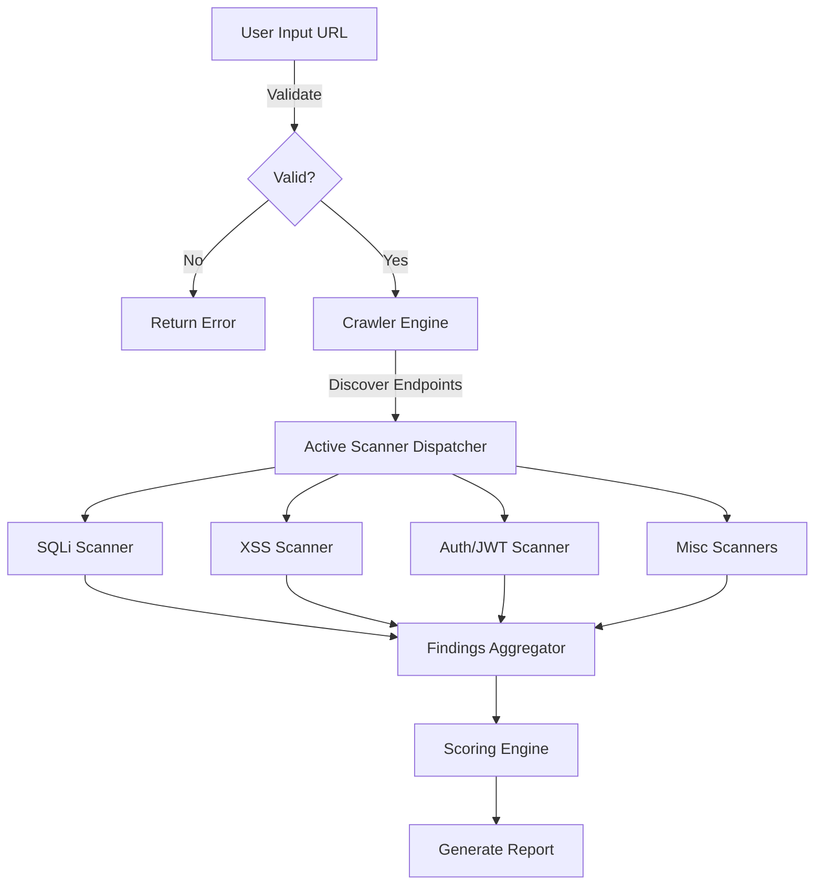
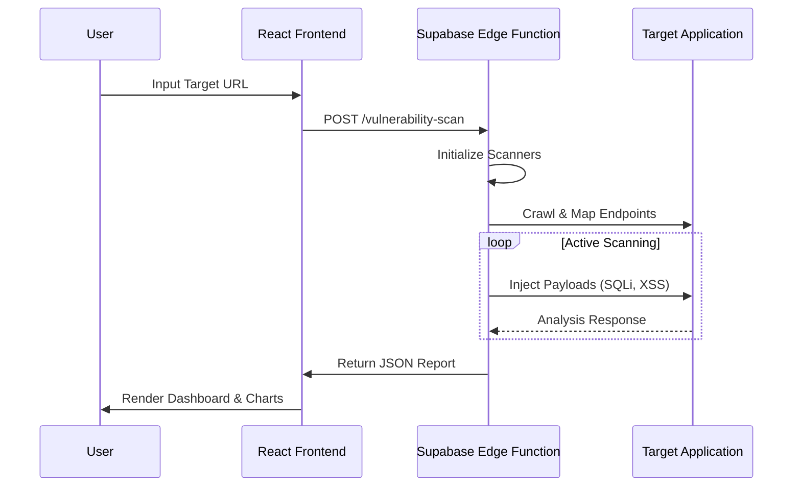
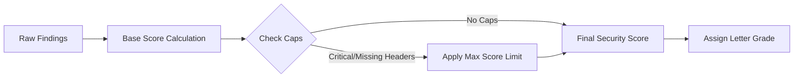
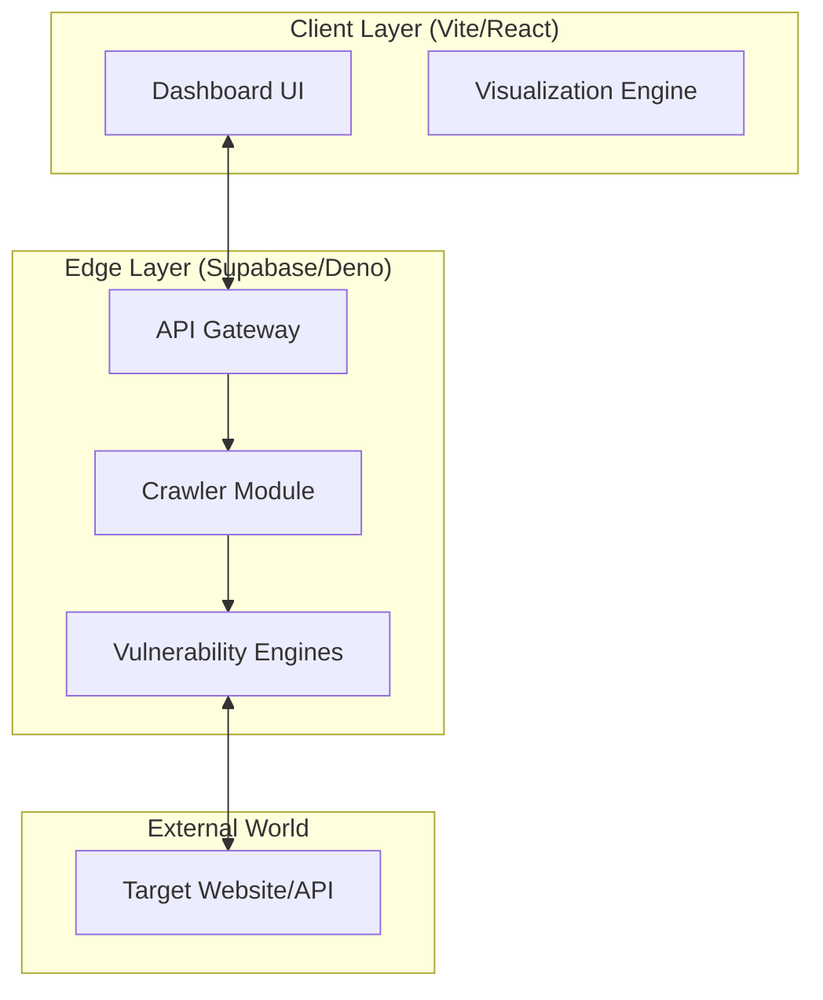

# SentinelX: Next-Gen Active Vulnerability Scanner

## 🛡️ Abstract

SentinelX is a cutting-edge, edge-first Dynamic Application Security Testing (DAST) solution. Unlike traditional scanners that rely on heavy containerized infrastructure, SentinelX runs entirely on serverless edge functions, utilizing advanced heuristic engines to detect complex vulnerabilities like Time-Based SQL Injection, Reflected XSS, and JWT misconfigurations in real-time.

## 🚀 Innovation & Scope

SentinelX redefines vulnerability scanning with a **Serverless, Edge-First Architecture**.

### Key Innovations
- **Edge-Native Scanning**: Powered by Deno and Supabase Edge Functions for massive scalability and low latency.
- **Deep Inspection Engines**:
    - **Time-Based Blind SQLi**: Detects subtle database delays (milliseconds precision).
    - **JWT & OAuth Analysis**: Validates token signatures and `algo: none` attacks.
    - **Smart Crawling**: Dynamically maps attack surfaces while respecting local network restrictions.
- **Micro-Service Scalability**: Each scan runs in an isolated, ephemeral environment.

### Scope
- **Target**: Single Page Applications (SPAs), REST APIs, and traditional Web Apps.
- **Coverage**: OWASP Top 10 (Injection, Broken Access Control, Cryptographic Failures, Security Misconfiguration, SSRF, etc.).
- **Infrastructure**: Zero-config deployment on Supabase.

## 🔄 Functional Workflow



## 👥 Interaction Model



## 📊 Data Processing Workflow



## 🏗️ Architecture



## 💻 Tech Stack

| Component | Technology | Description |
|-----------|------------|-------------|
| **Frontend** | React 18, Vite | High-performance UI framework |
| **Styling** | Tailwind CSS, Shadcn UI | Modern, responsive design system |
| **Backend** | Supabase Edge Functions | Serverless logic via Deno |
| **Language** | TypeScript | Type-safe development across full stack |
| **Visualization** | Recharts, Lucide | Interactive charts and iconography |

---

## How can I edit this code?

**Use your preferred IDE**

If you want to work locally using your own IDE, you can clone this repo and push changes. Pushed changes will also be reflected in Lovable.

The only requirement is having Node.js & npm installed - [install with nvm](https://github.com/nvm-sh/nvm#installing-and-updating)

Follow these steps:

```sh
# Step 1: Clone the repository using the project's Git URL.
git clone <YOUR_GIT_URL>

# Step 2: Navigate to the project directory.
cd <YOUR_PROJECT_NAME>

# Step 3: Install the necessary dependencies.
npm i

# Step 4: Start the development server with auto-reloading and an instant preview.
npm run dev
```
