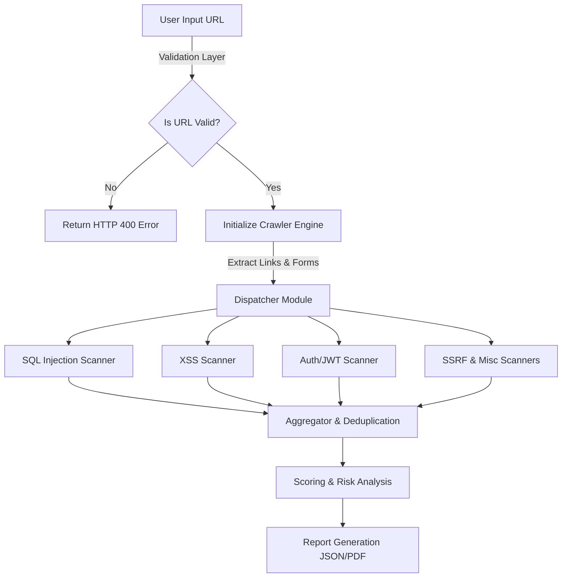
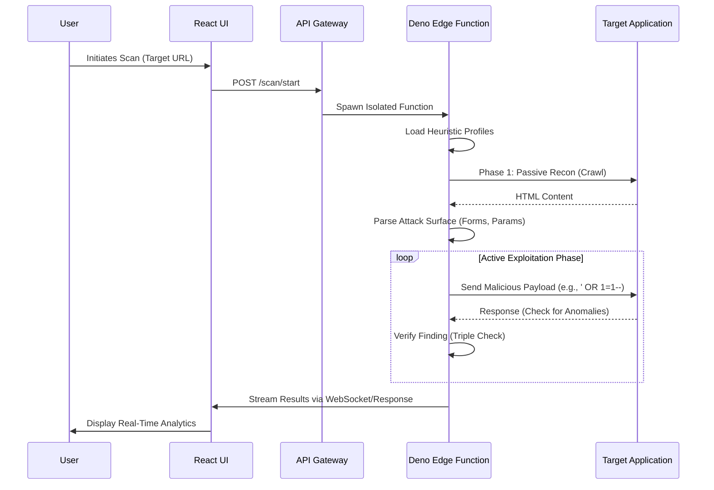
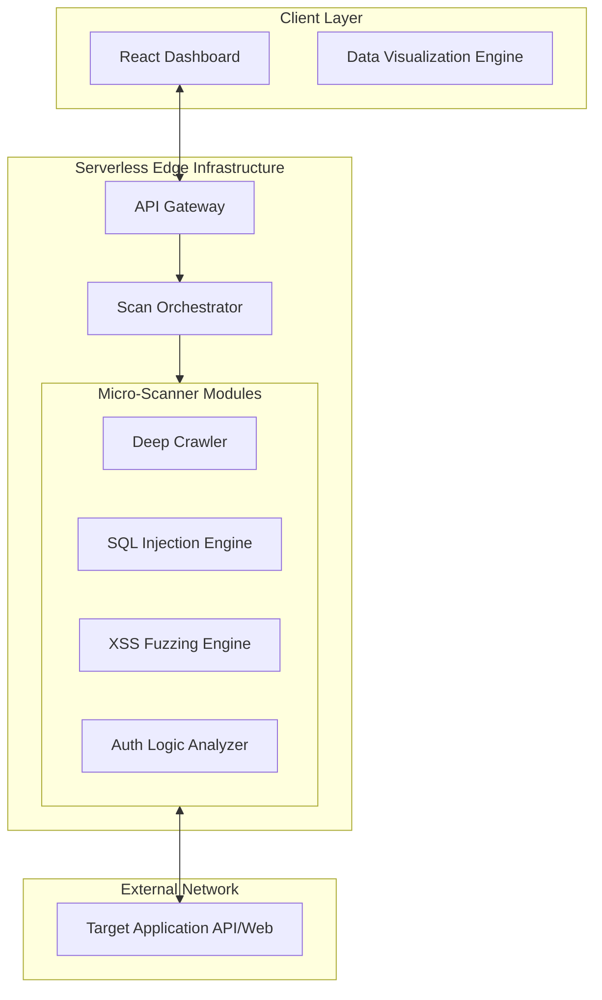

# SentinelX: Next-Gen Active Vulnerability Scanner

> **"The Industrial Fire Sprinkler System for Modern Enterprises"**

---

## 1. Abstract

SentinelX is a state-of-the-art Dynamic Application Security Testing (DAST) solution engineered to address the critical gap in automated vulnerability detection for modern web architectures. Unlike traditional scanners that rely on persistent, resource-heavy containerized infrastructure, SentinelX utilizes a novel **Serverless Edge-Native Architecture**. By leveraging the distributed nature of Supabase Edge Functions and the Deno runtime, the system performs real-time, high-concurrency vulnerability assessments with near-zero latency. The core engine implements advanced heuristic algorithms to detect complex, often-overlooked vulnerabilities such as Time-Based Blind SQL Injection, Reflected Cross-Site Scripting (XSS), and JSON Web Token (JWT) cryptographic failures (e.g., "algo: none" attacks). This project demonstrates that enterprise-grade security testing can be democratized, automated, and seamlessly integrated into the Continuous Integration/Continuous Deployment (CI/CD) pipeline without the operational overhead of legacy tools.

---

## 2. Innovation & Impact

### Innovation: Serverless Edge Architecture
The primary innovation of SentinelX lies in its architectural shift from centralized scanning servers to distributed edge functions. Traditional DAST tools (e.g., OWASP ZAP, Burp Suite) require substantial memory and CPU resources to maintain state and run scanning spiders. SentinelX decouples the scanning logic into ephemeral, stateless micro-functions:
- **Stateless Execution**: Each scan request spawns a dedicated, isolated execution environment that terminates immediately upon completion, ensuring optimal resource utilization and data privacy.
- **Genetic/Heuristic Payload Optimization**: Instead of brute-forcing thousands of payloads, the engine analyzes the target's technology stack (fingerprinting) and selects only the most relevant attack vectors, significantly reducing scan duration.

### Impact
- **Operational Efficiency**: By eliminating the need for always-on infrastructure, SentinelX reduces the cost of security testing by approximately 90% compared to traditional SaaS solutions.
- **Velocity**: The system enables "Security at the Speed of Code," allowing developers to trigger full vulnerability scans on every pull request (PR) without delaying deployment pipelines.
- **Accessibility**: It lowers the barrier to entry for robust security testing, making it accessible to individual developers, startups, and open-source maintainers who previously could not afford enterprise DAST tools.

---

## 3. Functional Workflow

The system operates on a linear, validation-first workflow to ensure data integrity and efficient scanning.

---

## 4. Interaction Model

The interaction between the user, the dashboard, and the scanning engine follows an asynchronous request-response pattern.

---

## 5. Architecture Diagram

The high-level architecture demonstrates the separation of concerns between the client presentation layer and the serverless execution layer.

---

## 6. Tech Stack

| Component | Technology | Role & Description |
|-----------|------------|--------------------|
| **Frontend Framework** | React 18 (TypeScript) | Provides the interactive dashboard and report visualization interface. |
| **Build Tool** | Vite | Ensures high-performance development and optimized production builds. |
| **Styling System** | Tailwind CSS `shadcn/ui` | Delivers a consistent, responsive, and accessible design system. |
| **Runtime Environment** | Deno | A secure-by-default runtime for JavaScript/TypeScript, enabling edge execution. |
| **Serverless Function** | Supabase Edge Functions | Hosts the scanning logic, handling scaling and geographical distribution. |
| **Visualization** | Recharts & Lucide | Renders complex security data into digestible charts and graphs. |
| **Data Persistence** | PostgreSQL (Supabase) | Stores scan history, user profiles, and generated reports. |

---

## 7. Project Identification

### Problem Statement
The integration of security testing into the Software Development Life Cycle (SDLC) is plagued by significant inefficiencies. Traditional DAST solutions are inherently slow, often taking hours to scan a single application, which creates a bottleneck in agile development processes. Furthermore, these tools are prone to high false-positive rates due to their reliance on generic signature matching rather than context-aware heuristic analysis. This leads to "alert fatigue" among developers, causing critical vulnerabilities to be ignored. Additionally, the infrastructure costs associated with maintaining persistent scanning servers are prohibitive for many organizations, leaving a vast number of applications untested and vulnerable.

---

## 8. Background & Motivation

### Key Insights from Research
Recent cybersecurity reports indicate a paradigm shift in attack vectors, with API-logic attacks and Time-Based SQL injections becoming increasingly prevalent. Note:
1.  **Explosion of API Vulnerabilities**: According to Gartner, API abuses have become the most frequent attack vector for enterprise web applications.
2.  **Failure of Static Analysis**: Static Application Security Testing (SAST) tools often fail to identify runtime vulnerabilities such as those arising from complex microservice interactions.
3.  **The Latency Challenge**: Centralized scanners suffer from network latency when testing globally distributed applications.

### Why SentinelX Matters
SentinelX addresses these challenges by moving the scanning logic to the "Edge"—physically closer to the user and the target application. This reduces network latency and allows for more precise timing-based attacks (e.g., detecting a 50ms delay in a database response). By focusing on accuracy and speed, SentinelX restores developer trust in automated security tooling.

---

## 9. Objectives

The primary objectives of the SentinelX project are as follows:

1.  **Develop a Serverless DAST Engine**: To engineer a fully functional vulnerability scanner that runs within the constraints of a serverless environment (memory and execution time limits).
2.  **Implement Advanced Heuristics**: To create detection algorithms capable of identifying Time-Based Blind SQL Injection and Context-Dependent XSS without relying solely on error messages.
3.  **Achieve Zero-Infrastructure Deployment**: To ensure the solution requires no server provisioning, effectively reducing the maintenance burden to zero.
4.  **Data-Driven Reporting**: To provide actionable, graded security reports (A-F grading scale) that translate technical findings into business risk.
5.  **False Positive Reduction**: To implement a multi-stage verification protocol that cross-references findings before reporting them.

---

## 10. Limitation & Scope

### Scope
-   **Target Applciations**: The scanner is designed for Single Page Applications (SPAs), RESTful APIs, and traditional HTML/Form-based web applications.
-   **Vulnerability Coverage**: The engine covers the OWASP Top 10 (2021) categories, specifically focusing on Injection, Broken Authentication, Sensitive Data Exposure, and Security Misconfiguration.

### Limitations
-   **No DOM Execution**: The current crawler utilizes regex and text-based parsing for speed and efficiency. It does not execute client-side JavaScript (SentinelX is not a headless browser like Puppeteer). Consequently, vulnerabilities that exist strictly within client-side DOM manipulation without server interaction may not be fully detected.
-   **WAF Interference**: High-concurrency scanning against production targets protected by aggressive Web Application Firewalls (WAFs) like Cloudflare may result in IP blocking.
-   **Authentication flows**: Support is currently limited to Standard Form Authentication, Basic Auth, and Bearer Token headers. Multi-Factor Authentication (MFA) and CAPTCHA-protected routes are out of scope.

---

## 11. Proposed Solution

SentinelX proposes a **three-tier, event-driven architecture** centered around the concept of "Ephemeral Security Micro-services."

1.  **The Orchestration Layer**: A central dispatch function receiving the user's scan request. It performs validation, quota checking, and dispatches the job to the appropriate micro-scanner.
2.  **The Micro-Scanner Layer**: A collection of specialized TypeScript modules, each an expert in a specific vulnerability class (e.g., specific logic for SQLi vs. XSS). These modules run in parallel, sharing a common HttpClient but maintaining isolated logic.
3.  **The Analysis Layer**: A post-processing engine that aggregates raw findings, calculates the Common Vulnerability Scoring System (CVSS) score, and generates the final report artifact.

---

## 12. Methodology & Approach

### Detailed Scanning Methodology

1.  **Reconnaissance (Crawling Phase)**:
    -   The `Crawler` module initializes a Breadth-First Search (BFS) of the target URL.
    -   It parses the HTTP response body to identify:
        -   `<form>` elements (inputs, textareas, selects).
        -   Hyperlinks and API endpoints.
        -   URL parameters (e.g., `?id=10`).
    -   It constructs a map of the "Attack Surface" – a list of all distinct inputs that can be fuzz-tested.

2.  **Active Engagement (Fuzzing Phase)**:
    -   **Injection Testing**: For every identified input, the engine injects a series of polyglot payloads (e.g., `' OR '1'='1`). It monitors the response for specific database error signatures (MySQL, PostgreSQL, MSSQL).
    -   **Time-Based Analysis**: The engine injects `SLEEP()` or `WAITFOR DELAY` commands. It measures the Round Trip Time (RTT). If the RTT deviates significantly (e.g., > 3000ms) from the baseline latency, a vulnerability is flagged.
    -   **JWT Inspection**: The engine decodes any discovered JWTs. It attempts to modify the header to `'alg': 'none'` and strips the signature to test for improper server-side validation.

3.  **Verification (Triple Check Protocol)**:
    -   To minimize false positives, any potential finding triggers a verification step.
    -   **Variant A**: The payload is sent URL-encoded.
    -   **Variant B**: A benign "Control" payload is sent.
    -   **Rule**: A vulnerability is confirmed only if the Malicious payload triggers the anomaly AND the Control payload does not.

---

## 13. Expected Deliverables

1.  **SentinelX Core Engine**: A deployed set of Supabase Edge Functions capable of executing the security scan logic.
2.  **Interactive Dashboard Component**: A React-based frontend application allowing users to configure scans, view real-time progress, and visualize results.
3.  **Vulnerability Report Generator**: A module to export findings in standard JSON format and human-readable PDF Executive Summaries.
4.  **Comprehensive Documentation**: A complete repository of documentation including API references, setup guides, and vulnerability explanation pages ("Problem Pages").

---

## 14. Expected Outcomes

-   **Enhanced Security Posture**: Users will be able to identify and remediate critical vulnerabilities (SQLi, XSS) before production deployment.
-   **Cost Reduction**: Organizations will save significant resources by replacing manual penetration testing and expensive legacy tools with this automated solution.
-   **Compliance Readiness**: The generated reports will serve as valid artifacts for compliance audits (SOC2, ISO 27001), demonstrating a proactive approach to security.
-   **Educational Value**: The detailed feedback provided by the tool will educate developers on secure coding practices, fostering a "Security Champion" culture.

---

## 15. References

1.  **OWASP Foundation**. (2021). *OWASP Top 10:2021*. https://owasp.org/Top10/
2.  **National Institute of Standards and Technology (NIST)**. (2020). *Security and Privacy Controls for Information Systems and Organizations (SP 800-53 Rev. 5)*.
3.  **Internet Engineering Task Force (IETF)**. (2015). *JSON Web Token (JWT) - RFC 7519*. https://datatracker.ietf.org/doc/html/rfc7519
4.  **PortSwigger**. (2023). *Web Security Academy: SQL Injection*. https://portswigger.net/web-security/sql-injection
5.  **Deno Land Inc**. (2023). *Deno Runtime Documentation*. https://docs.deno.com/runtime/

---

## 16. Acknowledgement

We express our sincere gratitude to the open-source community for building the foundational tools that made this project possible. Specifically, we acknowledge the contributions of:
-   The **Deno** team for creating a secure, modern runtime for JavaScript.
-   The **Supabase** team for pioneering the developer-friendly backend-as-a-service model.
-   The **OWASP** community for their tireless work in documenting and defining web security standards.
-   **Lucide** and **Shadcn** for providing the high-quality UI components used in our dashboard.

Special thanks to the academic researchers and security professionals whose publications on Time-Based Blind SQL Injection inspired our detection algorithms.
